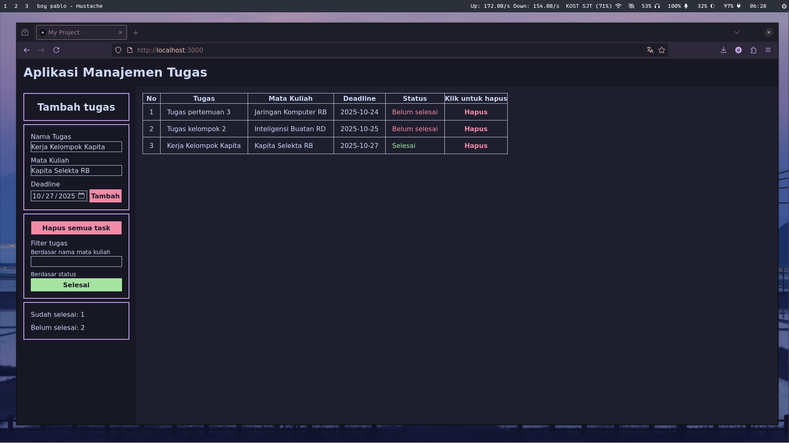
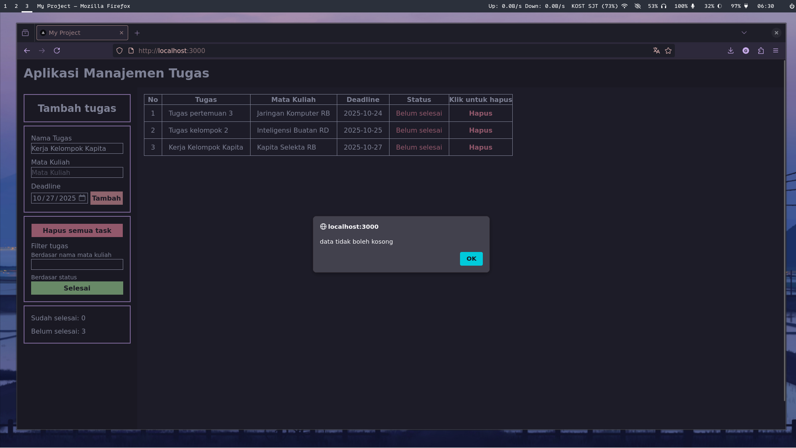
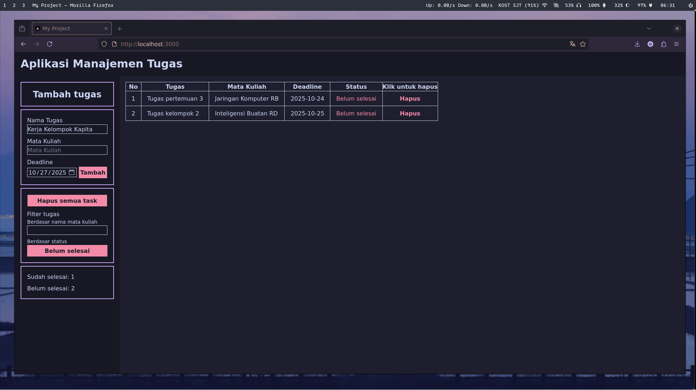

# Aplikasi Manajemen Tugas

## Deskripsi Singkat

Aplikasi Manajemen Tugas adalah aplikasi berbasis web untuk mencatat dan mengelola daftar tugas harian.  
Semua data disimpan secara lokal menggunakan `localStorage`, sehingga aplikasi dapat digunakan tanpa koneksi internet.

### Fitur Utama

- Menambahkan tugas baru beserta mata kuliah dan tenggat waktu
- Menandai tugas sebagai selesai
- Menghapus tugas tertentu atau seluruh daftar tugas
- Penyimpanan data otomatis di browser
- Validasi form agar input tidak kosong

## Screenshot Aplikasi
#### Tampilan dasar


#### Input validation


#### Filter


## Cara Menjalankan Aplikasi

1. Clone repository:
   ```
   git clone https://github.com/Faiq1818/pemrograman_web_itera_123140139.git
   ```
2. Masuk ke folder tugasnya
   ```
   cd pemrograman_web_itera_123140139/faiqghozyerlangga_123140139_pertemuan1
   ```
3. Install dependensi
   ```
   npm install
   ```
4. Jalankan localhost
   ```
   npm run start
   ```
5. Cek http://localhost:3000/
