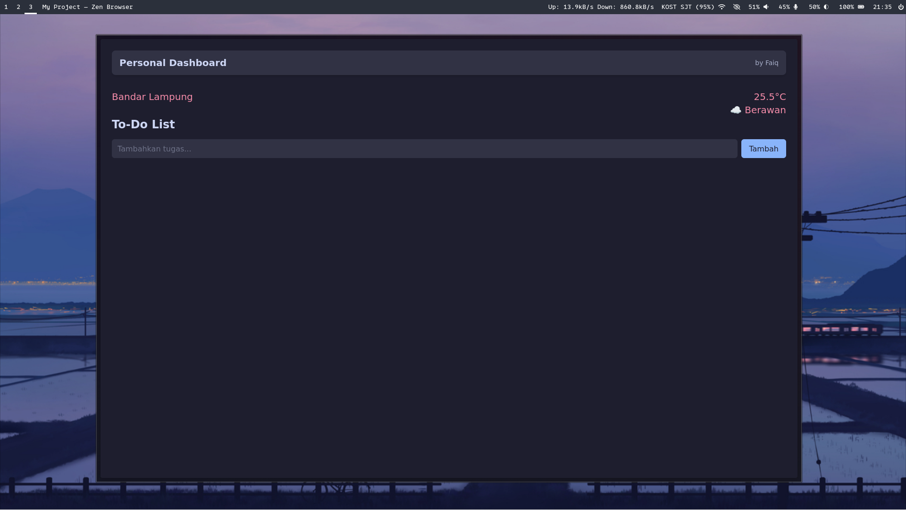
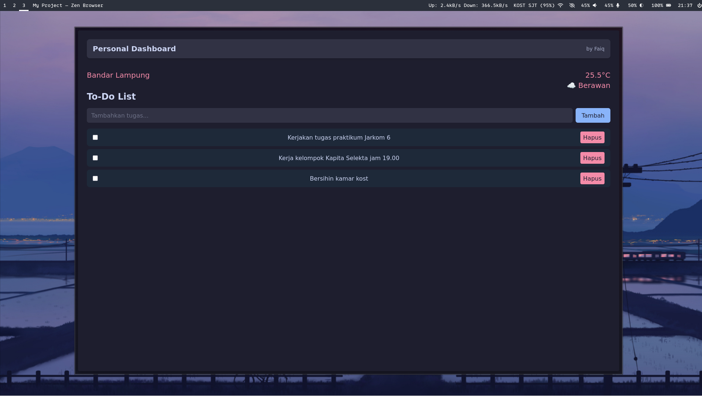

# Aplikasi Dashboard Pribadi

## Fitur Utama

- Menambahkan, menandai dan menghapus todolist
- Penyimpanan data otomatis di browser
- Menampilkan data cuaca dan suhu sekarang

## Screenshot Aplikasi
#### Tampilan dasar


#### Input validation


#### Filter


## Cara Menjalankan Aplikasi

1. Clone repository:
   ```
   git clone https://github.com/Faiq1818/pemrograman_web_itera_123140139.git
   ```
2. Masuk ke folder tugasnya
   ```
   cd pemrograman_web_itera_123140139/faiqghozyerlangga_123140139_pertemuan2
   ```
3. Install dependensi
   ```
   npm install
   ```
4. Jalankan localhost
   ```
   npm run start
   ```
5. Browser otomatis terbuka atau cek di localhost:8080

## Pengguanan localstorage dan validation form
1. penggunaan localstorage di web saya ini adalah untuk menyimpan data dari tugas-tugas yg disimpan, localstorage ini akan disimpan di cache browser sendiri dan akan terhapus jika cache dihapus, localstorage ini tidak dienkripsi, jadi tidak cocok untuk dijadikan tempat menyimpan data-data penting atau rahasia.
Berikut adalah contoh penggunaanya, disini saya menggunakan api localstorage untuk mengambil data dari localstorage:
#### js/filter.js
```js
  function renderFiltered() {
    table.innerHTML = `
      <tr class="border">
        <th class="border">No</th>
        <th class="border">Tugas</th>
        <th class="border">Mata Kuliah</th>
        <th class="border">Deadline</th>
        <th class="border">Status</th>
        <th class="border">Klik untuk hapus</th>
      </tr>
    `;

    const keyword = filterInput.value.toLowerCase().trim();
    const data = JSON.parse(localStorage.getItem("tasks")) || [];

    // filter data
    const filteredData = data.filter(
      (task) =>
        task.mataKuliah.toLowerCase().includes(keyword) &&
        task.done === showDone,
    );
```
2. Penggunaan validation di project saya ini ada saat ketika add tugas, yg mana akan mengecek apakah input nama tugas, matakuliah atau deadline kosong atau tidak, jika kosong akan diberikan alert dan ditolak, jika berisi maka diperbolehkan dan dimasukan ke localstorage.
Berikut adalah contoh kodenya, disini saya menggunakan api localstorage untuk menyimpan dan mengambil data tugas:
##### js/add.js
```js
  button.addEventListener("click", () => {
    let data = JSON.parse(localStorage.getItem("tasks")) || [];

    // input form validation
    if (
      assignmentNameInput.value === "" ||
      classNameInput.value === "" ||
      deadlineInput.value === ""
    ) {
      alert("data tidak boleh kosong");
    } else {
      data.push({
        namaTugas: assignmentNameInput.value,
        mataKuliah: classNameInput.value,
        deadline: deadlineInput.value,
        done: false,
      });
      // save to local storage
      localStorage.setItem("tasks", JSON.stringify(data));
    }

    location.reload();
  });
```
