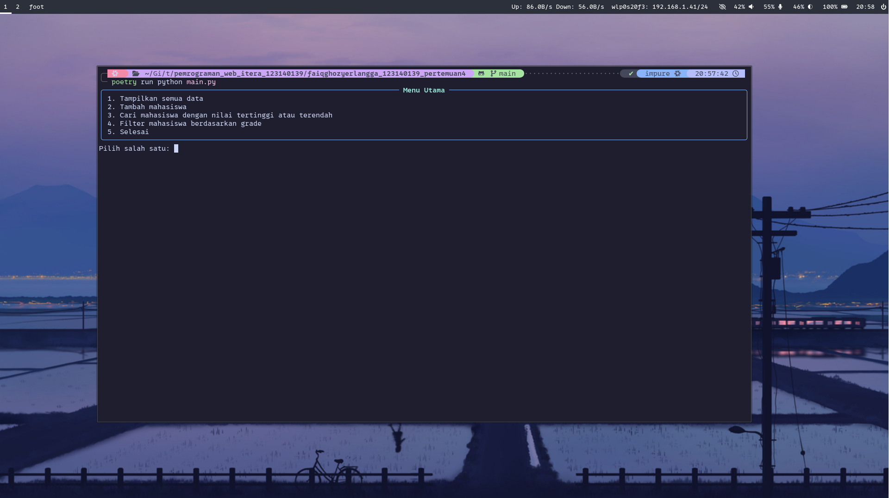
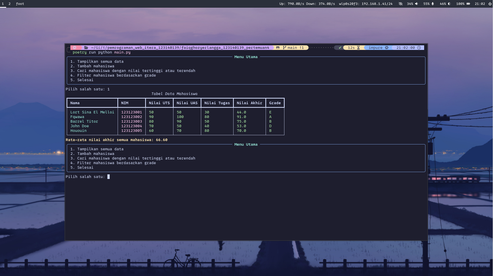
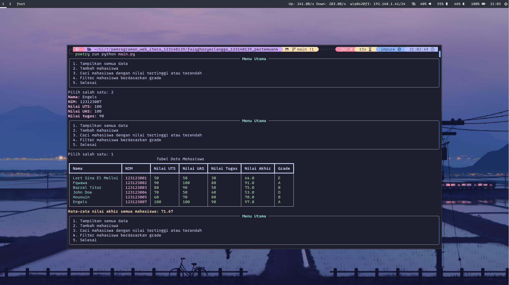

# Aplikasi Dashboard Pribadi

## Fitur Utama

- Menambahkan, menandai dan menghapus todolist
- Penyimpanan data otomatis di browser
- Menampilkan data cuaca dan suhu sekarang

## Screenshot Aplikasi
#### Tampilan dasar


#### Menampilkan todolist yg didapat dari localstorage atau ditambahkan langsung


#### List bisa ditandai selesai


## Cara Menjalankan Aplikasi

1. Clone repository:
   ```
   git clone https://github.com/Faiq1818/pemrograman_web_itera_123140139.git
   ```
2. Masuk ke folder tugasnya
   ```
   cd pemrograman_web_itera_123140139/faiqghozyerlangga_123140139_pertemuan2
   ```
3. Install dependensi
   ```
   npm install
   ```
4. Jalankan localhost
   ```
   npm run start
   ```
5. Browser otomatis terbuka atau cek di localhost:8080

## Pengguanan fitur ES6+
1. let dan const

penggunaan fitur ini sangat umum di kode saya ini, berikut contohnya:
#### js/todolist.js
```js
  const saveTasks = () => {
    const tasks = [];
    list.querySelectorAll("li").forEach((li) => {
      let text = li.querySelector("span").textContent.trim();
      let completed = li.querySelector("input[type='checkbox']").checked;
      tasks.push({ text, completed });
    });
    localStorage.setItem("tasks", JSON.stringify(tasks));
  };
```
