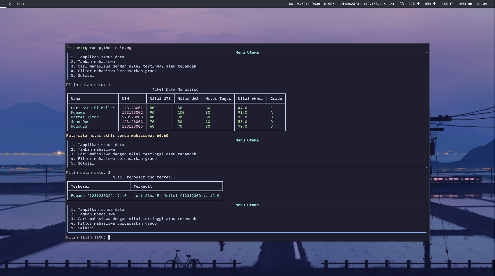
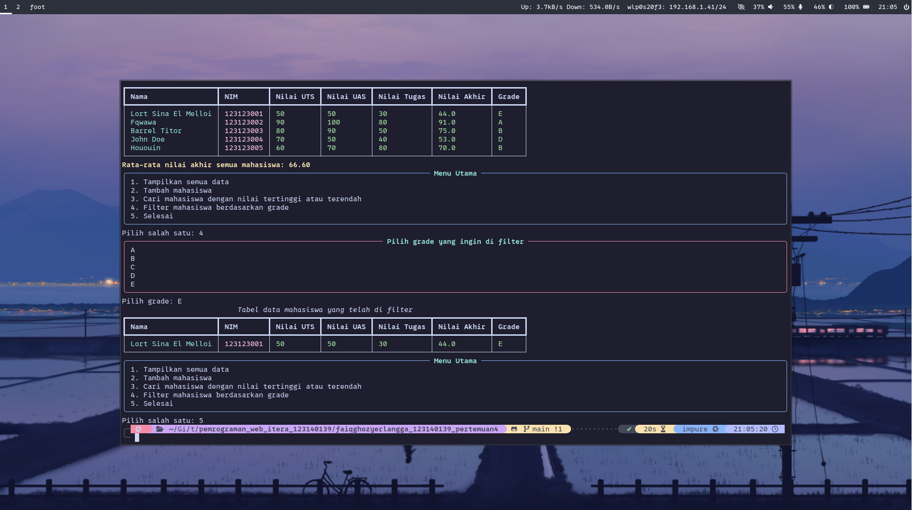

# Aplikasi CLI Manajemen Data Mahasiswa Sederhana

## Fitur Utama

- Mengecek data mahasiswa
- Menambah data mahasiswa
- Menentukan grade, rata-rata, dan filter berdasarkan grade mahasiswa

## Screenshot Aplikasi
#### Tampilan Awal


#### Menampilkan tabel data mahasiswa


#### Menambahkan mahasiswa


#### Mengecek mahasiswa dengan nilai terbesar dan terkecil


#### Menfilter mahasiswa berdasarkan gradenya


## Cara Menjalankan Aplikasi

1. Clone repository:
   ```
   git clone https://github.com/Faiq1818/pemrograman_web_itera_123140139.git
   ```
2. Masuk ke folder tugasnya
   ```
   cd pemrograman_web_itera_123140139/faiqghozyerlangga_123140139_pertemuan4
   ```
3. Install dependensi (Pastikan poetry telah terinstall untuk management dependency, jika belum, silahkan install di dokumentasi resminya)
   ```
   poetry install --no-root
   ```
4. Jalankan localhost
   ```
   poetry run python main.py
   ```

## Dokumentasi
1. Seluruh data mahasiswa berada di data/dictionary
2. Seluruh logika kode ada di logic/
3. main.py hanya sebagai entry file dan menampilkan tabel pilihan
4. Saya menggunakan Poetry sebagai manajemen dependensi, ini digunakan agar bisa lock versi dependensi agar tidak ada error akibat dependensi yg breaking changes
5. Flake.nix dan flake.lock adalah file saya yg berguna memanage versi python saya di NixOs
