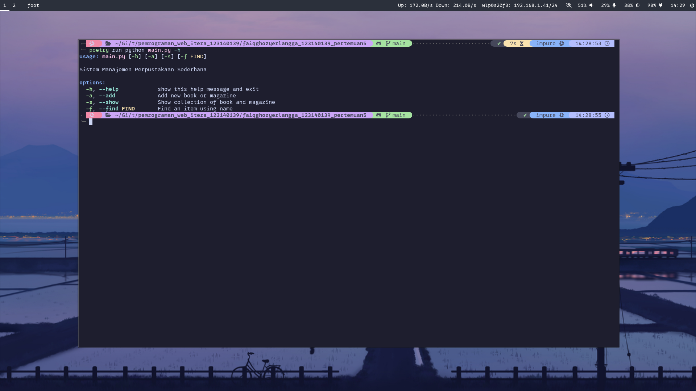
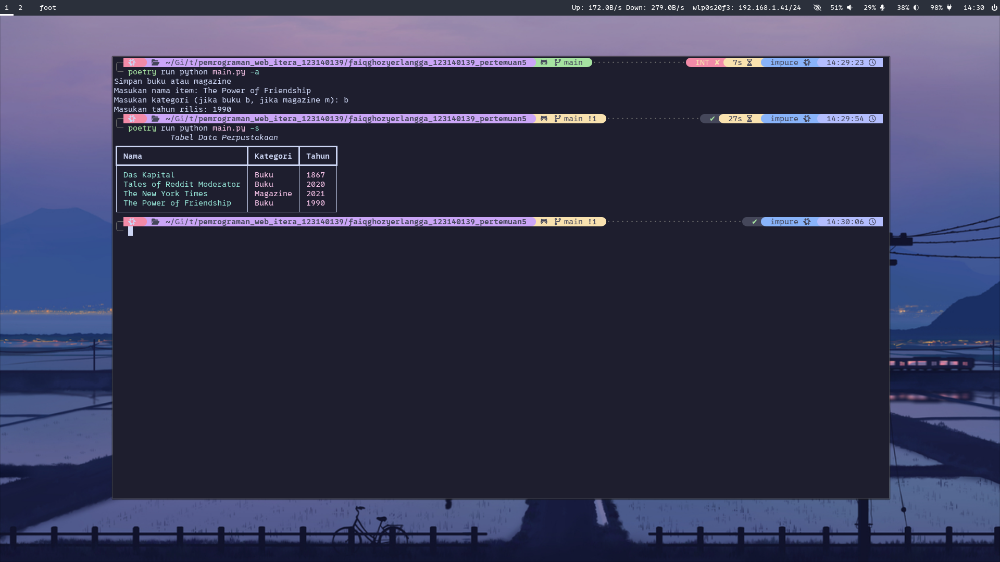
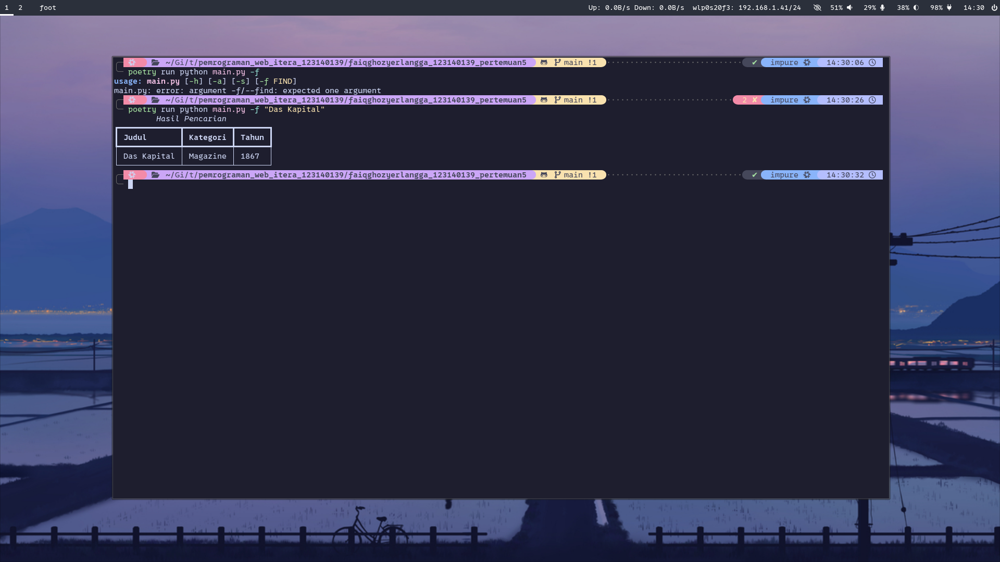

# Sistem Manajemen Perpustakaan Sederhana

## Fitur Utama

- Menambahkan data buku atau magazine
- Mengecek item yang ada
- Mencari data item berdasarkan nama

## Screenshot Aplikasi
#### Tampilan Help


#### Menambahkan data dan menampilkan data


#### Mencari data


## Cara Menjalankan Aplikasi

1. Clone repository:
   ```
   git clone https://github.com/Faiq1818/pemrograman_web_itera_123140139.git
   ```
2. Masuk ke folder tugasnya
   ```
   cd pemrograman_web_itera_123140139/faiqghozyerlangga_123140139_pertemuan5
   ```
3. Install dependensi (Pastikan poetry telah terinstall untuk management dependency, jika belum, silahkan install di dokumentasi resminya)
   ```
   poetry install --no-root
   ```
4. Jalankan localhost
   ```
   poetry run python main.py -h
   ```

## Dokumentasi
1. Seluruh data mahasiswa berada di data/dictionary
2. Seluruh logika kode ada di logic/
3. main.py hanya sebagai entry file dan menampilkan tabel pilihan
4. Saya menggunakan Poetry sebagai manajemen dependensi, ini digunakan agar bisa lock versi dependensi agar tidak ada error akibat dependensi yg breaking changes
5. Saya menggunakan library bernama Rich untuk menampilkan tabel dan text berwarna di cli
6. Flake.nix dan flake.lock adalah file yg berguna memanage versi python saya di NixOs
