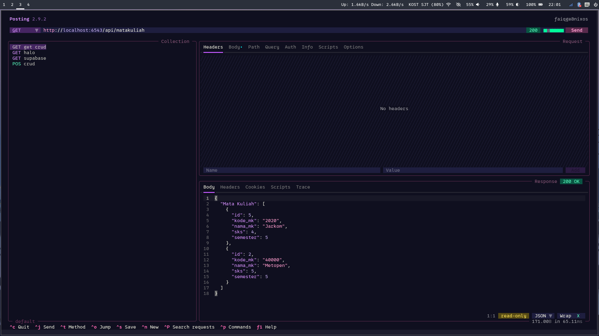
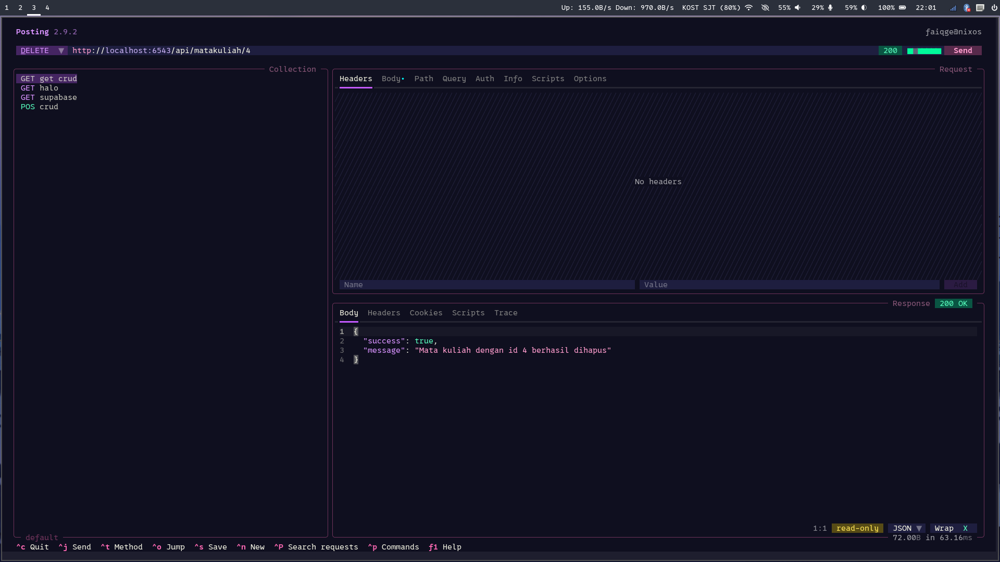

# Aplikasi Manajemen Matakuliah dengan Pyramid
Program ini bertujuan untuk memanajemen mata kuliah menggunakan Python Pyramid dengan database Postgresql

## Screenshot Request API menggunakan posting



## Cara Menjalankan Aplikasi

1. Clone repository:
   ```
   git clone https://github.com/Faiq1818/pemrograman_web_itera_123140139.git
   ```
2. Masuk ke folder tugasnya
   ```
   cd pemrograman_web_itera_123140139/faiqghozyerlangga_123140139_pertemuan6/pyramid_scaffold
   ```
3. Buat env
   ```
   python3 -m venv env
   ```
4. Install dependensi
   ```
   env/bin/pip install --upgrade pip setuptools
   env/bin/pip install -e ".[testing]"
   pip install psycopg2-binary
   ```
5. Jalankan Postgresql dan buat user
   ```
    -- 1. Buat database
    CREATE DATABASE pyramid_mahasiswa;
   
    -- 2. Buat user baru
    CREATE USER pyramid_user WITH ENCRYPTED PASSWORD 'pyramid_pass';
    
    -- 3. Beri user izin ke database
    GRANT ALL PRIVILEGES ON DATABASE pyramid_mahasiswa TO pyramid_user;
    
    -- 4. Pindah ke database pyramid_mahasiswa
    \c pyramid_mahasiswa
    
    -- 5. Beri izin schema public ke user
    GRANT USAGE, CREATE ON SCHEMA public TO pyramid_user;
    
    -- 6. Ubah owner schema public (opsional tapi paling aman)
    ALTER SCHEMA public OWNER TO pyramid_user;
    
    -- 7. Pastikan owner default table/sequence future
    ALTER DEFAULT PRIVILEGES IN SCHEMA public
    GRANT ALL ON TABLES TO pyramid_user;
    
    ALTER DEFAULT PRIVILEGES IN SCHEMA public
    GRANT ALL ON SEQUENCES TO pyramid_user;
    
    -- 8. Keluar dari psql
    \q
   ```
6. Initialize alembic
   ```
   env/bin/alembic -c development.ini revision --autogenerate -m "init"
   env/bin/alembic -c development.ini upgrade head
   ```
7. Jalankan Aplikasi
   ```
   env/bin/pserve development.ini
   ```

## API Endpoints

### 1. GET /api/matakuliah
**Request:**
```bash
curl -X GET http://localhost:6543/api/matakuliah
```
**Response:**
```bash
{"Mata Kuliah": [{"id": 5, "kode_mk": "2020", "nama_mk": "Jarkom", "sks": 4, "semester": 5}, {"id": 2, "kode_mk": "40000", "nama_mk": "Metopen", "sks": 5, "semester": 5}]}%   
```

### 2. POST /api/matakuliah
**Request:**
```bash
curl -X POST http://localhost:6543/api/matakuliah -H "Content-Type: application/json" -d '{
  "kode_mk": "333", "nama_mk": "Test2", "sks": 3, "semester": 3
}'
```
**Response:**
```bash
{"success": true, "matakuliah": {"id": 6, "kode_mk": "333", "nama_mk": "Test2", "sks": 3, "semester": 3}}% 
```

### 3. GET /api/matakuliah/{id}
**Request:**
```bash
curl -X GET http://localhost:6543/api/matakuliah{5}
```
**Response:**
```bash
{"Mata Kuliah": {"id": 5, "kode_mk": "2020", "nama_mk": "Jarkom", "sks": 4, "semester": 5}}% 
```

### 4. PUT /api/matakuliah/{id}
**Request:**
```bash
curl -X PUT http://localhost:6543/api/matakuliah/2 -H "Content-Type: application/json" -d '{
  "nama_mk": "Pemrograman Aplikasi Web"
}'
```
**Response:**
```bash
{"success": true, "mahasiswa": {"id": 2, "kode_mk": "40000", "nama_mk": "Pemrograman Aplikasi Web", "sks": 5, "semester": 5}}%
```

### 5. DELETE /api/matakuliah/{id}
**Request:**
```bash
curl -X DELETE http://localhost:6543/api/matakuliah/2 
```
**Response:**
```bash
{"success": true, "message": "Mata kuliah dengan id 2 berhasil dihapus"}% 
```
